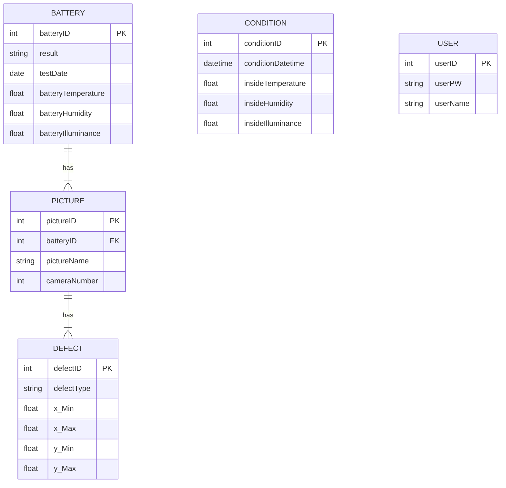

# 배터리 양불판정 및 분류

## 프로젝트 개요
배터리의 외관 사진을 3가지 각도에서 촬영하여 불량 여부를 판별하는 시스템을 개발한다. 촬영된 이미지를 분석하여 정상 제품과 불량 제품을 구분하고, 이를 로봇 팔을 이용하여 자동으로 분류한다. 이를 통해 품질 관리의 효율성을 높이고, 불량 제품의 선별 과정을 자동화하여 생산성을 향상시키는 데 기여한다.

## Architecture
---

---

### 개발기간
- 2024.07.01 ~ 2024.08.20

## 팀원
- 이하빈(팀장): AI
- 강대호: AI
- 김건우: 프론트 엔드
- 박기범: 센서, 로봇팔
- 송재훈: 백엔드

## 개발 환경
- **웹 서버**: 
- **프로그래밍 언어**: 
- **개발 도구**: 
- **프레임워크**: 
- **데이터베이스**:

## ER다이어그램

## 주요 기능

## 세부 내용
