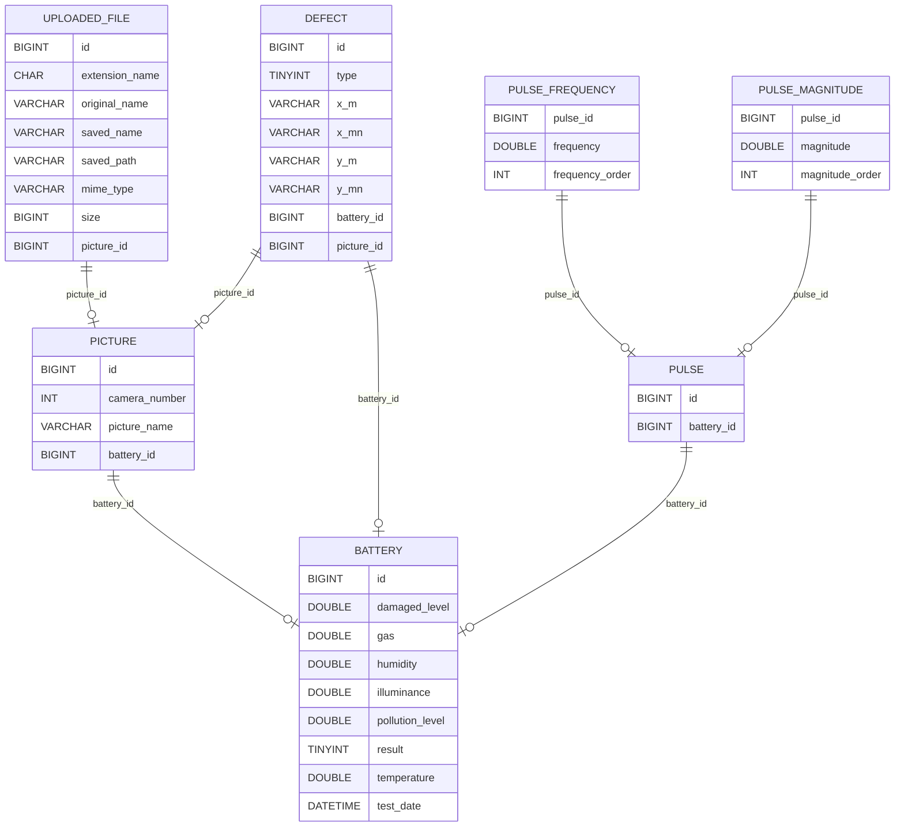

# 🔋 배터리 양불판정 및 분류
(https://github.com/I5-BatteryCheck/.github/blob/main/profile/i5-readme-video.gif)
---

## 📄프로젝트 개요
불량 배터리의 선별과정을 자동화하여 생산성을 향상하고, 품질관리의 효율성을 높이는 최적화된 스마트팩토리 시스템을 개발한다.

---

## 🔍 Architecture

---

### 📅 개발기간
- 2024.07.01 ~ 2024.08.20

---

## 🧑 팀원
- 이하빈(팀장): PL
- 강대호: AI
- 김건우: 프론트 엔드
- 박기범: LOW-LEVEL
- 송재훈: 백엔드

---

## ⚙️ 개발 환경
### 🌐 Frontend
     
### 💻 Backend
   
### 🤖 AI
  
  

### 🗜️ Low-Level
   
 

---

## 📄 ER Diagram

---

## 📐 UML Class Diagram

``` mermaid
classDiagram
direction BT
class Battery {
  - Long id
  - Double temperature
  - Double illuminance
  - Double pollutionLevel
  - LocalDateTime testDate
  - Double humidity
  - Double gas
  - Result result
  - Double damagedLevel
  + getId() Long
  + getResult() Result
  + setTestDate(LocalDateTime) void
  + getTestDate() LocalDateTime
  + builder() BatteryBuilder
  + getTemperature() Double
  + setTemperature(Double) void
  + setHumidity(Double) void
  + getHumidity() Double
  + setIlluminance(Double) void
  + getIlluminance() Double
  + getPollutionLevel() Double
  + getGas() Double
  + setDamagedLevel(Double) void
  + setPollutionLevel(Double) void
  + setGas(Double) void
  + setId(Long) void
  + setResult(Result) void
  + getDamagedLevel() Double
}
class BatteryController {
  - BatteryService batteryService
  - getAllDefectRatio() ApiResponse~BatteryResponseDto~
  + getBatteryConditionAverage() ApiResponse~List~BatteryConditionDailyResponseDto~~
  + getProductCountRecent5days() ApiResponse~List~BatteryDailyCountResponseDto~~
  - searchDefectRatioByDate() ApiResponse~List~BatteryDailyResponseDto~~
  + getBatteryCondition(Long) ApiResponse~BatteryConditionResponseDto~
}
class BatteryRepository {
<<Interface>>
  + findFirstByOrderByIdDesc() Battery
  + countByResult(Result) Long
  + countByResultAndTestDateBetween(Result, LocalDateTime, LocalDateTime) Long
  + countByTestDateBetween(LocalDateTime, LocalDateTime) Long
  + findBatteryConditionAverage(LocalDateTime, LocalDateTime) BatteryConditionResponseDto
}
class BatteryService {
  - BatteryRepository batteryRepository
  + countAll() Long
  + findById(Long) Battery
  + findProductCountRecent5days() Map~Integer, Long~
  + findBatteryConditionAverageRecent5days() Map~Integer, BatteryConditionDailyResponseDto~
  + findRecent5Dates() List~LocalDate~
  + calculateAllNormalRatio() Double
  + save(Battery) Long
  + findBatteryCondition(Long) BatteryConditionResponseDto
  + calculateNormalRatioRecent5days() Map~Integer, Double~
  + findLatestBattery() Battery
}
class Defect {
  - String xMax
  - String yMin
  - String yMax
  - Long id
  - Picture picture
  - String xMin
  - Battery battery
  - Type type
  + getId() Long
  + builder() DefectBuilder
  + setId(Long) void
  + setBattery(Battery) void
  + setXMin(String) void
  + getType() Type
  + getXMin() String
  + setYMin(String) void
  + setPicture(Picture) void
  + getXMax() String
  + setType(Type) void
  + setYMax(String) void
  + setXMax(String) void
  + getYMin() String
  + getYMax() String
  + getBattery() Battery
  + getPicture() Picture
}
class DefectController {
  - DefectService defectService
  + getDefectRate() ApiResponse~DefectRateResponseDto~
  + getDefectTypeCountByDate() ApiResponse~List~BatteryDefectTypeResponseDto~~
}
class DefectRepository {
<<Interface>>
  + findByBatteryTestDateBetween(LocalDateTime, LocalDateTime) List~Defect~
}
class DefectService {
  - DefectRepository defectRepository
  - BatteryService batteryService
  + save(Defect) Long
  + countDefectTypeRecent5days() Map~Integer, Map~String, Long~~
  + getDefectRate() DefectRateResponseDto
  - getDefectsCount(List~Defect~) Map~String, Long~
}
class FileController {
  - BatteryService batteryService
  - Long batteryId
  - Logger log
  - FileUploadService fileUploadService
  - FileService fileService
  + uploadPicture(List~MultipartFile~, FileRequestDto) ApiResponse~FileResponseDto~
}
class FileDownloadService {
  - AmazonS3Client amazonS3Client
  - String bucket
  + getImageFile(String) byte[]
}
class FileName {
  - String originalName
  - String savedName
  - String savedPath
  - String extensionName
  + getOriginalName() String
  + getSavedName() String
  + getSavedPath() String
  + getExtensionName() String
  + builder() FileNameBuilder
}
class FileRepository {
<<Interface>>
  + findByBatteryIdAndCameraNumber(Long, Integer) UploadedFile
  + findByPicture(Picture) UploadedFile
  + findRecentThree() List~UploadedFile~
}
class FileService {
  - BatteryService batteryService
  - DefectService defectService
  - PictureService pictureService
  - FileRepository fileRepository
  + save(FileDto, FileRequestDto, Long) List~Long~
}
class FileUploadService {
  - Logger log
  - AmazonS3Client amazonS3Client
  - String bucket
  + uploadFiles(List~MultipartFile~) Map~String, File~
  - removeNewFile(File) void
  - upload(File, String) String
  + uploadFile(MultipartFile) Map~String, File~
  - putS3(File, String) String
  - convert(MultipartFile) Optional~File~
}
class Picture {
  - Long id
  - String pictureName
  - List~Defect~ Defects
  - Integer cameraNumber
  - Battery battery
  + builder() PictureBuilder
  + getId() Long
  + getBattery() Battery
  + getPictureName() String
  + getCameraNumber() Integer
  + getDefects() List~Defect~
  + setId(Long) void
  + setBattery(Battery) void
  + setPictureName(String) void
  + setCameraNumber(Integer) void
  + setDefects(List~Defect~) void
}
class PictureController {
  - FileDownloadService fileDownloadService
  - PictureService pictureService
  - FileRepository fileRepository
  + getImage() ApiResponse~PictureWebResponseDto~
  + getStatistics(LocalDateTime, LocalDateTime, List~Result~, List~Type~, List~Integer~) ApiResponse~List~PictureFilterResponseDto~~
}
class PictureRepository {
<<Interface>>
  + findByBatteryIdAndCameraNumber(Long, Integer) Picture
  + findAllByFilters(LocalDateTime, LocalDateTime, List~Result~, List~Type~, List~Integer~) List~Picture~
}
class PictureService {
  - FileRepository fileRepository
  - PictureRepository pictureRepository
  - FileDownloadService fileDownloadService
  + save(Picture) Long
  + getStatistics(LocalDateTime, LocalDateTime, List~Result~, List~Type~, List~Integer~) List~PictureFilterResponseDto~
  + findByBatteryIdAndCameraNumber(Long, Integer) Picture
}
class Result {
<<enumeration>>
  +  DAMAGED
  - String key
  - String description
  +  NORMAL
  +  BOTH
  +  POLLUTION
  + getKey() String
  + getDescription() String
  + values() Result[]
  + valueOf(String) Result
}
class Type {
<<enumeration>>
  +  POLLUTION
  +  DAMAGED
  - String key
  - String description
  + values() Type[]
  + getKey() String
  + getDescription() String
  + valueOf(String) Type
}
class UploadedFile {
  - long size
  - FileName fileName
  - Long id
  - String mimeType
  - Picture picture
  + getSize() long
  + getId() Long
  + getFileName() FileName
  + getMimeType() String
  + setPicture(Picture) void
  + builder() UploadedFileBuilder
  + getPicture() Picture
  + setId(Long) void
  + setFileName(FileName) void
  + setSize(long) void
  + setMimeType(String) void
}
class User {
  - Long id
  - String password
  - String username
  + getId() Long
  + getUsername() String
  + getPassword() String
  + setId(Long) void
  + setUsername(String) void
  + setPassword(String) void
  + builder() UserBuilder
}
class UserRepository {
<<Interface>>

}

Battery "1" *--> "result 1" Result 
BatteryController "1" *--> "batteryService 1" BatteryService 
BatteryService "1" *--> "batteryRepository 1" BatteryRepository 
Defect "1" *--> "battery 1" Battery 
Defect "1" *--> "picture 1" Picture 
Defect "1" *--> "type 1" Type 
DefectController "1" *--> "defectService 1" DefectService 
DefectService "1" *--> "batteryService 1" BatteryService 
DefectService "1" *--> "defectRepository 1" DefectRepository 
FileController "1" *--> "batteryService 1" BatteryService 
FileController "1" *--> "fileService 1" FileService 
FileController "1" *--> "fileUploadService 1" FileUploadService 
FileService "1" *--> "batteryService 1" BatteryService 
FileService "1" *--> "defectService 1" DefectService 
FileService "1" *--> "fileRepository 1" FileRepository 
FileService "1" *--> "pictureService 1" PictureService 
Picture "1" *--> "battery 1" Battery 
Picture "1" *--> "Defects *" Defect 
PictureController "1" *--> "fileDownloadService 1" FileDownloadService 
PictureController "1" *--> "fileRepository 1" FileRepository 
PictureController "1" *--> "pictureService 1" PictureService 
PictureService "1" *--> "fileDownloadService 1" FileDownloadService 
PictureService "1" *--> "fileRepository 1" FileRepository 
PictureService "1" *--> "pictureRepository 1" PictureRepository 
UploadedFile "1" *--> "fileName 1" FileName 
UploadedFile "1" *--> "picture 1" Picture 
```

---

## 🧾 API 명세서

---

## ⭐ 주요 기능

- 온도, 습도, 조도, 가스 센서 데이터 시각화
- 배터리 결함 탐지 및 자동 분류
- 과거 배터리 생산, 불량, 상세 정보 조회 및 통계화
- 웹을 통한 생산환경 실시간 모니터링

  - ### 📦 생산 관리 [생산 관리 상세 wiki](https://github.com/I5-BatteryCheck/.github/wiki/%EA%B8%B0%EB%8A%A5(%EC%83%9D%EC%82%B0%EA%B4%80%EB%A6%AC))
     - 실시간 카메라
     - 탐지 결과
     - 생산량 설정
  - ### 📈 배터리 통계 [배터리 통계 상세 wiki](https://github.com/I5-BatteryCheck/.github/wiki/%EA%B8%B0%EB%8A%A5(%EB%B0%B0%ED%84%B0%EB%A6%AC-%ED%86%B5%EA%B3%84))
     - 목표수량 달성 현황 그래프
     - 불량율 및 불량비율 그래프
     - 최근 생산량, 불량율, 불량 유형, 동작 시간 그래프
  - ### 👀 과거 조회 [과거 조회 상세 wiki](https://github.com/I5-BatteryCheck/.github/wiki/%EA%B8%B0%EB%8A%A5(%EA%B3%BC%EA%B1%B0-%EC%A1%B0%ED%9A%8C))
     - 기간, 배터리 유형, 카메라 번호를 선택하여 필터링
     - 날짜, 판정, 결함유형, 카메라, 사진 조회기능
  - ### 🌡️ 생산 환경 모니터링 [생산 환경 모니터링 상세 wiki](https://github.com/I5-BatteryCheck/.github/wiki/%EA%B8%B0%EB%8A%A5(%EC%83%9D%EC%82%B0%ED%99%98%EA%B2%BD-%EB%AA%A8%EB%8B%88%ED%84%B0%EB%A7%81))
     - 실시간 온도, 습도, 조도, 가스 센서
     - 일별 온도, 습도, 조도, 가스 통계
     - 최적화 지수

---

	
## 🎬 프로젝트 결과물
### 생산 관리 페이지
  
  
### 배터리 통계 페이지
  
  
### 과거 조회 페이지
  
  
### 생산 환경 모니터링 페이지
  
  

